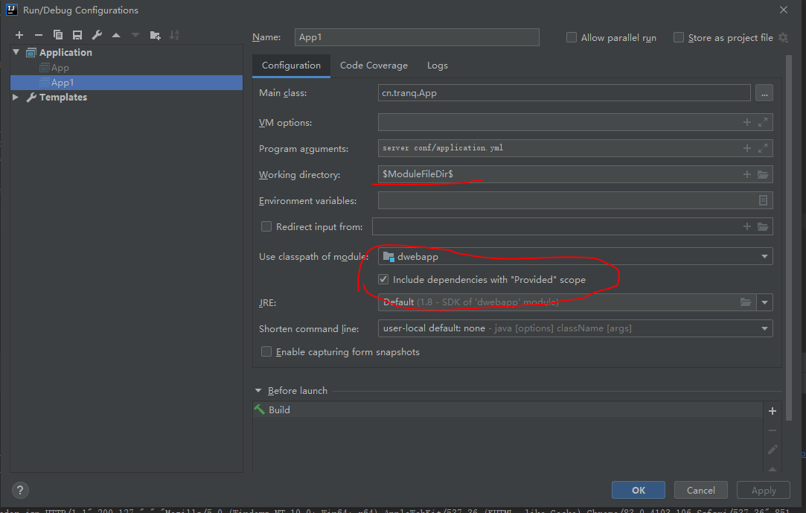

用dropwizard创建嵌入式webapp并支持JSP及struts2。

## 可行性依据
dropwizard启动时默认提供了一个基于jetty的HTTP Server，得益于jetty良好的模块化设计以及dropwizard插件式的架构，我们很容易在dropwizard创建jetty HTTP Server时为其配置WebApp支持。

## 关键步骤

### 定制ServerFactory
通过定制ServerFactory来替换dropwizard默认创建Server流程。
dropwizard通过application.yml配置中的server节点来定义创建的Server参数，默认支持的Server类型有：[simple, default]。

如下配置将创建支持RESTful API的Servlet Container:
```yaml
server:
  type: simple
  applicationContextPath: /application
  adminContextPath: /admin
  connector:
    type: http
    port: 8080
```

但默认创建的Servlet Conainer不能支持WebApp，这里扩展一个新的Server类型webapp来实现对WebApp的支持。

application.yml:
```yaml
server:
  type: webapp   #webapp 为新扩展的类型标志
  applicationContextPath: /application
  adminContextPath: /admin
  webAppContextPath: /webapp
  connector:
    type: http
    port: 8080
```
在重写ServerFactory的build方法，为Jetty Server增加WebAppContext即可为Server增加Webapp支持。
WebAppServerFactory(可以根据SimpleServerFactory的源码进行改写):
```java
@JsonTypeName("webapp")   
public class WebAppServerFactory extends AbstractServerFactory {
    @Override
    public Server build(Environment environment) {
        configure(environment);
        ...
        final ThreadPool threadPool = createThreadPool(environment.metrics());
        final Server server = buildServer(environment.lifecycle(), threadPool);   
        final Handler applicationHandler = createAppServlet(server, ...);
        final Handler adminHandler = createAdminServlet(server, ...);
        final Connector conn = connector.build(server, environment.metrics(),
                environment.getName(),
                null);
        server.addConnector(conn);
        final ContextRoutingHandler routingHandler = new ContextRoutingHandler(ImmutableMap.of(
                applicationContextPath, applicationHandler,
                adminContextPath, adminHandler,
                webAppContextPath, createWebAppContext(server)
        ));
        final Handler gzipHandler = buildGzipHandler(routingHandler);
        server.setHandler(addStatsHandler(addRequestLog(server, gzipHandler, environment.getName())));
        return server;      
    }

    private Handler createWebAppContext(Server server){
        WebAppContext context = new WebAppContext(new PathResource( new File("webapp")), webAppContextPath);
        context.setDescriptor("webapp/WEB-INF/web.xml");
        context.setServer(server);

        return context;
    }    
}
```
jackson通过JsonTypeName注解可以实现反序列化时指定抽象类型具体实例化时的子类型。 但是，需要在将子类型注册到ObjectMapper中。

dropwizard启动前在bootstrap中初始化了系统中反序列化使用的ObjectMapper，通过重写Application.initialize函数可以往ObjectMapper对象新增

```java
public class App extends Application<AppConfig>
{
    ...
    @Override
    public void initialize(Bootstrap<AppConfig> bootstrap) {
        super.initialize(bootstrap);
        bootstrap.getObjectMapper().registerSubtypes(WebAppServerFactory.class);
    }
}
```

### 开启jetty.webapp的JSP引擎

1. 创建程序的工作目录：
```
conf/
    application.yml
webapp
    WEB-INF/
        web.xml
    index.html
    index.jsp
target/
    cn.tranq.dwebapp.jar
```

2. 添加JSP引擎实现

启动程序，可以通过http://localhost:8080/webapp/index.html来访问页面，但是若访问jsp页面会提示：
```
HTTP ERROR 500:
JSP support not configured
```
即表明当前WebAppContext还不支持jsp，将jsp的引擎添加到classpath即可。
Jetty 9.2(含)用jetty-jsp(glassfish提供)，之后用apache-jsp（apache提供）。例如：
```xml
<properties>
    <jetty.version>9.4.18.v20190429</jetty.version>
</properties>
<dependency>
    <groupId>org.eclipse.jetty</groupId>
    <artifactId>apache-jsp</artifactId>
    <version>${jetty.version}</version>
    <scope>provided</scope>
</dependency>
```
为了支持JSTL标签解析，还需要apache-jstl库。

3. 开启 Servlet Specification Annotations
默认WebAppContext中没有开启此功能，但支持JSP必须开启。
在WebAppContext配置的ClassList中增加AnnotationConfiguration（需要增加到JettyWebXmlConfiguration之前）, 修订WebAppServerFactory的createWebAppContext：
```java
private Handler createWebAppContext(Server server){
    WebAppContext context = new WebAppContext(new PathResource( new File("webapp")), webAppContextPath);
    context.setDescriptor("webapp/WEB-INF/web.xml");
    context.setServer(server);

    Configuration.ClassList classList = Configuration.ClassList.setServerDefault(server);
    classList.addBefore(
            "org.eclipse.jetty.webapp.JettyWebXmlConfiguration",
            "org.eclipse.jetty.annotations.AnnotationConfiguration");
    return context;
}
```
以上classlist需要确保classpath中添加了jetty-annotations：
```xml
<dependency>
    <groupId>org.eclipse.jetty</groupId>
    <artifactId>jetty-annotations</artifactId>
    <version>${jetty.version}</version>
</dependency>
```

注：否则访问jsp页面，还会出现：org.apache.jasper.JasperException: Unable to compile class for JSP错误。

4. 在IntelliJ中运行程序

需做如下设置:



## 参考
* [Java Servlet Specification](https://javaee.github.io/servlet-spec/)
* [Embedded Jetty Examples](https://www.eclipse.org/jetty/documentation/current/embedded-examples.html#embedded-webapp-jsp)
* [Configuring JSP Support](https://www.eclipse.org/jetty/documentation/current/configuring-jsp.html)
* [Enable Servlet annotation in Jetty](https://www.eclipse.org/jetty/documentation/current/annotations.html)
* [Webapp Configuratons](https://www.eclipse.org/jetty/documentation/current/configuring-webapps.html#webapp-configurations)